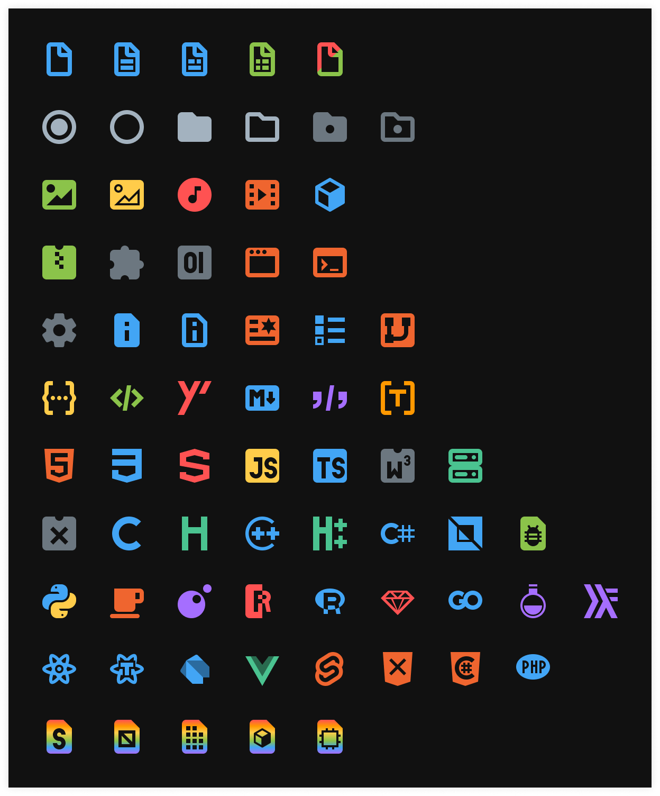
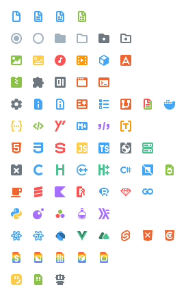

---

...and the icons still look good at a low resolution and on any background.

And with more icons to come! [is your favorite language missing?](https://github.com/CiberTurtle/Sharp-Icons/issues/new/choose)

---

[Figma Project](https://www.figma.com/file/XTSnjiwI5MXJnqEwZDetnT/VSCode-Icons) | [Github Repo](https://github.com/CiberTurtle/Sharp-Icons) | [Issue Tracker](https://github.com/CiberTurtle/Sharp-Icons/issues) | [Changelog](CHANGELOG.md) | [Me](https://github.com/CiberTurtle)
