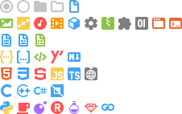
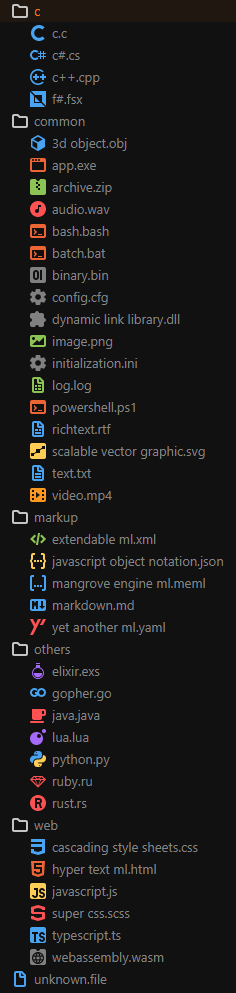

 v0.0.1

---

All icons are designed at 16px so they render sharp.

How it looks for you

How it look in a project

more icons coming soon... [is your favorite langauge missing?](https://github.com/CiberTurtle/Sharp-Icons/issues)

---

[Figma Project](https://www.figma.com/file/XTSnjiwI5MXJnqEwZDetnT/VSCode-Icons) | [Github Repo](https://github.com/CiberTurtle/Sharp-Icons) | [Report Bugs / Suggest Features](https://github.com/CiberTurtle/Sharp-Icons/issues) | [Changelog](CHANGELOG.md) | [About Me](https://github.com/CiberTurtle)
