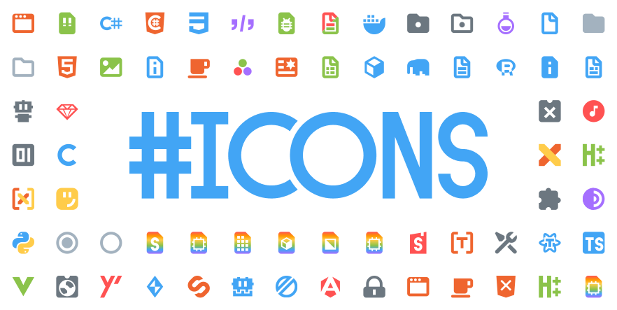
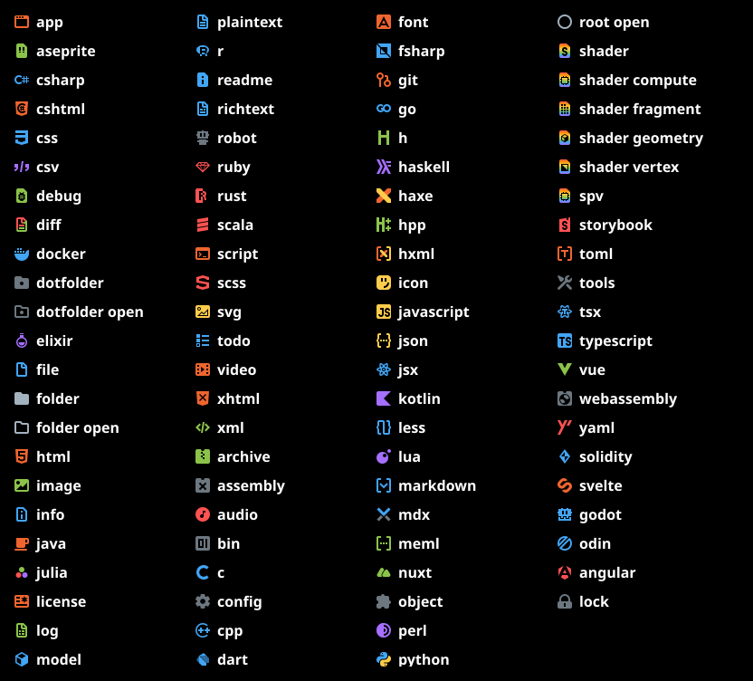

This theme is meant to be a less blurry and sharper alternitive to the popular [Material Icon Theme](https://marketplace.visualstudio.com/items?itemName=PKief.material-icon-theme) that I used to use.

	

		Here's a boring technical explanation on why these icons are not blurry.
	

	The file icons in vscode are `16px`. In other themes the icons are `24px` which means they get scaled down to `16px` by vscode and are made blurry as a result. These icons are designed at `16px` which mean no scaling is done by vscode and the icons remain sharp.

There are many themes to match themes such as Solarized, Gruvbox and Monokai. Each theme also has a "folderless" variant if you prefer the arrows in the default vscode theme.

These are the icons that have been made so far:

*And with more icons to come...* [Is your favorite language missing?](https://github.com/CiberTurtle/Sharp-Icons/issues/new/choose)

---

[Github](https://github.com/CiberTurtle/Sharp-Icons) | [Figma Project](https://www.figma.com/file/XTSnjiwI5MXJnqEwZDetnT/VSCode-Icons)
